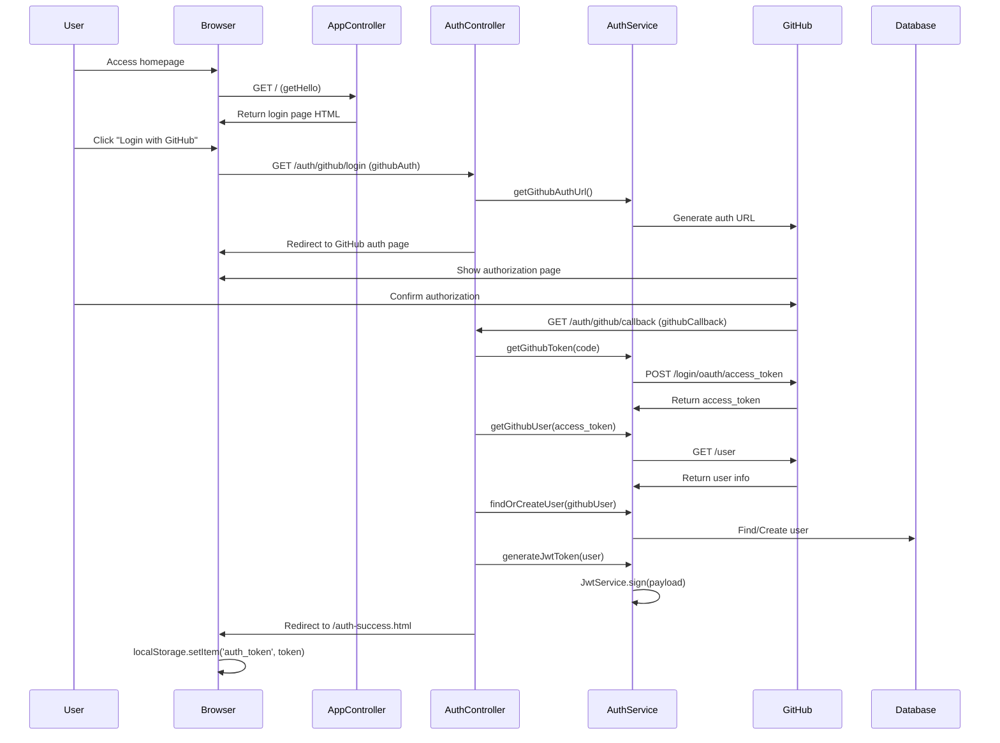
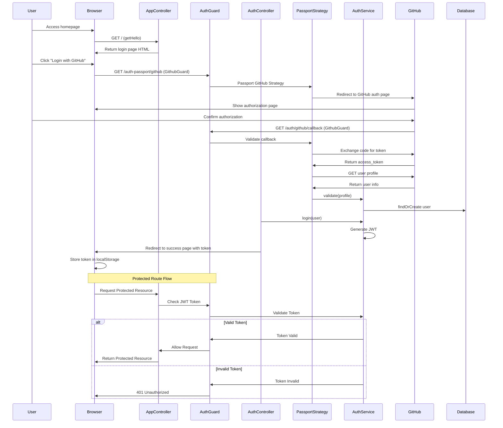

# NestJS OAuth2 Demo

NestJS OAuth2 Demo with and without Passportjs

## Setquence diagram

### Without passportjs



### with passportjs



## Passport Implementation Analysis

Using Passport.js in OAuth2.0 flow simplifies the implementation in several ways:

1. **Standardized Authentication Flow**:

   - Passport abstracts the OAuth2.0 flow into strategies
   - Handles the complexity of token exchange and user profile fetching

2. **Built-in Middleware**:

   - Provides Guards and Decorators for easy integration
   - Automatic session handling if needed

3. **Simplified Code Structure**:

   - Reduces boilerplate code
   - Centralizes authentication logic in strategies

4. **Security Benefits**:
   - Battle-tested implementations
   - Built-in protection against common vulnerabilities

## Description

[Nest](https://github.com/nestjs/nest) framework TypeScript starter repository.

### Project setup

```bash
$ pnpm install
```

### Compile and run the project

```bash
# development
$ pnpm run start

# watch mode
$ pnpm run start:dev

# production mode
$ pnpm run start:prod
```

### Support

Nest is an MIT-licensed open source project. It can grow thanks to the sponsors and support by the amazing backers. If you'd like to join them, please [read more here](https://docs.nestjs.com/support).

### Stay in touch

- Author - [Kamil Myśliwiec](https://twitter.com/kammysliwiec)
- Website - [https://nestjs.com](https://nestjs.com/)
- Twitter - [@nestframework](https://twitter.com/nestframework)

### License

Nest is [MIT licensed](https://github.com/nestjs/nest/blob/master/LICENSE).
